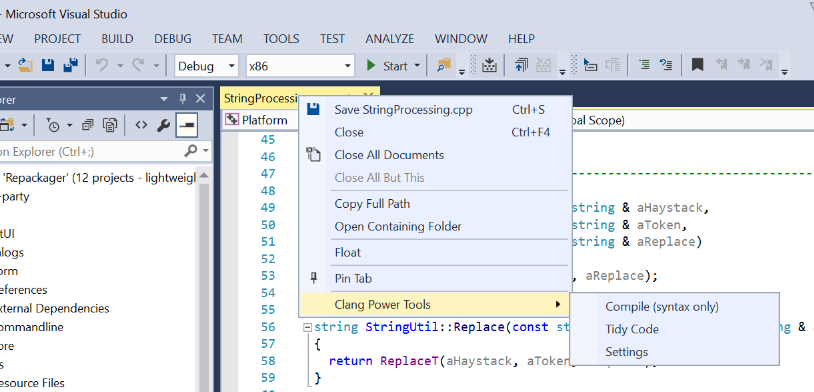
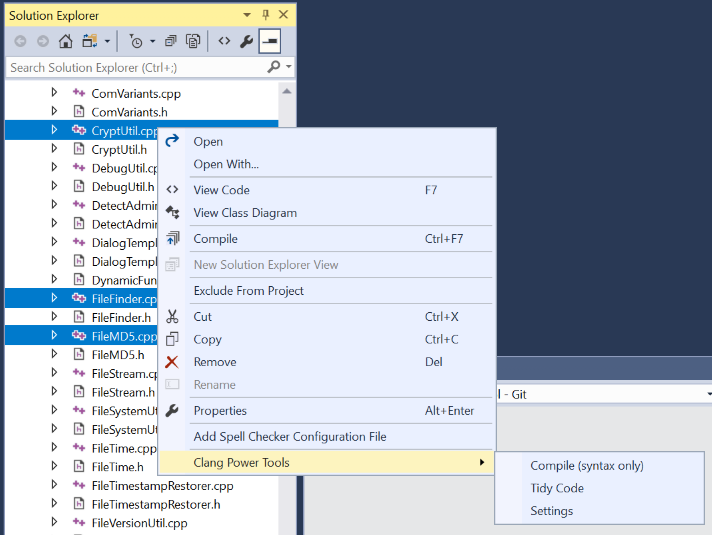
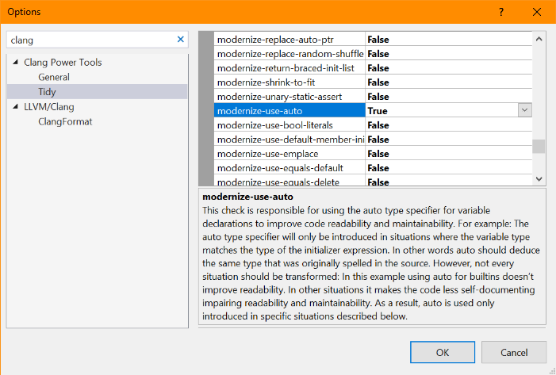
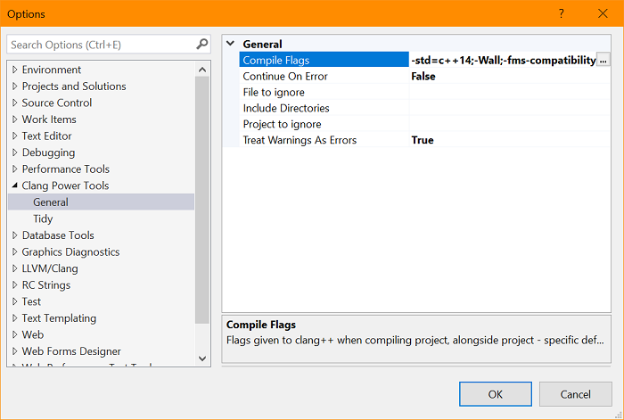

Clang Power Tools
=================

A tool bringing clang-tidy magic to Visual Studio C++ developers.

This Visual Studio extension helps Visual Studio C++ developers leverage Clang/LLVM tools like clang-tidy in order to perform various code transformations and fixes like modernizing code to C++11/14/17 and finding subtle latent bugs with its static analyzer and ‘cppcoreguidelines’ modules (Guidelines Support Library).

A list of available checks that clang-tidy can perform:  
https://clang.llvm.org/extra/clang-tidy/checks/list.html  
https://clang-analyzer.llvm.org/available_checks.html

The extension can be configured via the standard Visual Studio options panel.  
**Tools** > **Options** > **Clang Power Tools**  
You can customize the tool behavior as well as the clang++ compilation flags, clang-tidy checks, etc.

### Requirements

Download and install **Clang for Windows** (LLVM pre-built binary)  
http://releases.llvm.org/5.0.0/LLVM-5.0.0-win64.exe  
http://releases.llvm.org/download.html

We will automatically load clang from the default installation path *C:\Program Files\LLVM*. If you prefer to use a different location you must manually add the **bin** folder to **PATH**.  

Download and install at least **PowerShell 3.0** (v2.0 shipped with Windows 7 doesn't work)

https://www.microsoft.com/en-us/download/details.aspx?id=34595

### Download 

The latest version of this extension is available at [Visual Studio Gallery](https://marketplace.visualstudio.com/items?itemName=vs-publisher-690586.ClangPowerTools).
