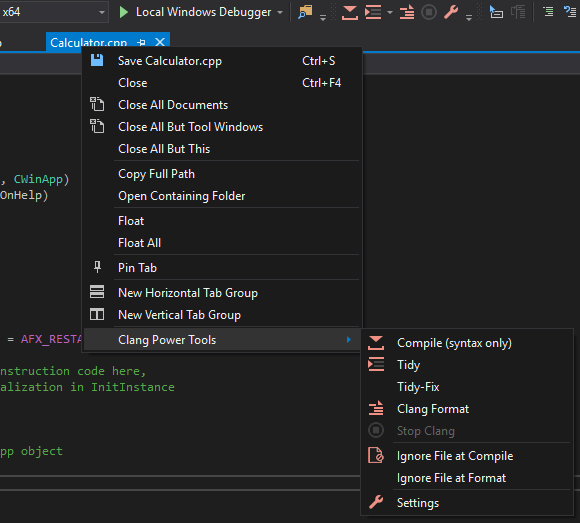
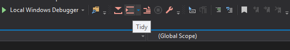
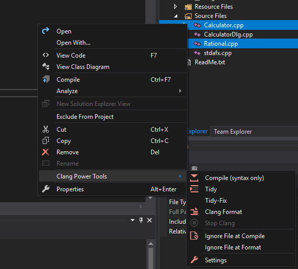
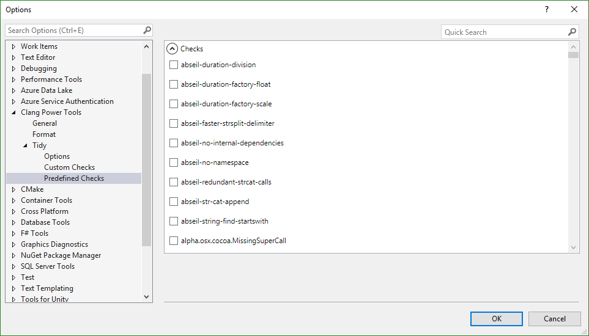
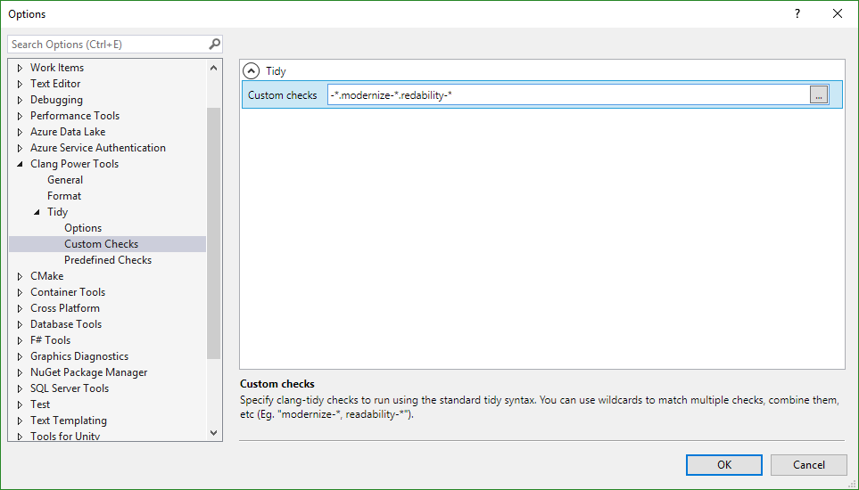
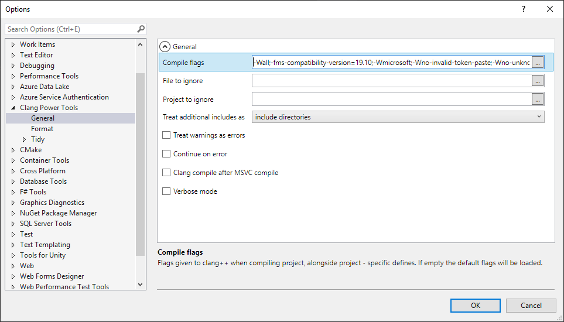

_Clang Power Tools_ is a **free** Visual Studio extension helping Visual Studio C++ developers leverage Clang/LLVM tools (`clang++`, `clang-tidy` and `clang-format`), in order to perform various code transformations and fixes like modernizing code to C++11/14/17 and finding subtle latent bugs with its static analyzer and CppCoreGuidelines checks.

**NEW**: Built-in support for **[clang-format](https://clang.llvm.org/docs/ClangFormat.html)**  
Auto-format source file on save, configurable [style options](https://clang.llvm.org/docs/ClangFormatStyleOptions.html), file extension rules, etc.

### Download 

Install this extension from [Visual Studio Marketplace](https://marketplace.visualstudio.com/items?itemName=vs-publisher-690586.ClangPowerTools)

Works with Visual Studio 2015 / 2017

### Features

A list of available checks that clang-tidy can perform:  
- [clang-tidy checks](https://clang.llvm.org/extra/clang-tidy/checks/list.html)  
- [clang-analyzer checks](https://clang-analyzer.llvm.org/available_checks.html)

Custom clang-tidy wildcard checks:

The extension can be configured via the standard Visual Studio options panel.  
**Tools** > **Options** > **Clang Power Tools**  
You can customize the tool behavior as well as the clang++ compilation flags, clang-tidy checks, etc.

### PowerShell scripts (for CI / automation):

- [clang-build.ps1](https://github.com/Caphyon/clang-power-tools/blob/master/ClangPowerTools/ClangPowerTools/clang-build.ps1)  
- [sample-clang-build.ps1](https://github.com/Caphyon/clang-power-tools/blob/master/ClangPowerTools/ClangPowerTools/sample-clang-build.ps1)

### Requirements

Visual Studio 2015 / 2017

Download and install **Clang for Windows** (LLVM pre-built binary)  
[LLVM-5.0.1-win64](http://releases.llvm.org/5.0.1/LLVM-5.0.1-win64.exe)  
[releases.llvm.org/download.html](http://releases.llvm.org/download.html)

We will automatically load clang from the default installation path *C:\Program Files\LLVM*. If you prefer to use a different location you must manually add the **bin** folder to **PATH**.  

Windows 7: Download and install at least [PowerShell 3.0](https://www.microsoft.com/en-us/download/details.aspx?id=34595) (already available on Windows10)  

### Version History

[Release Notes](CHANGELOG.md)

### Tips / Q & A

[Tips and Frequently asked questions](QaA.md)

### Feedback

If you have any suggestions or feedback about Clang Power Tools, or if you encounter any issues with your projects, please submit [here](https://github.com/Caphyon/clang-power-tools/issues).

We're excited to hear about your experience using Clang Power Tools.
